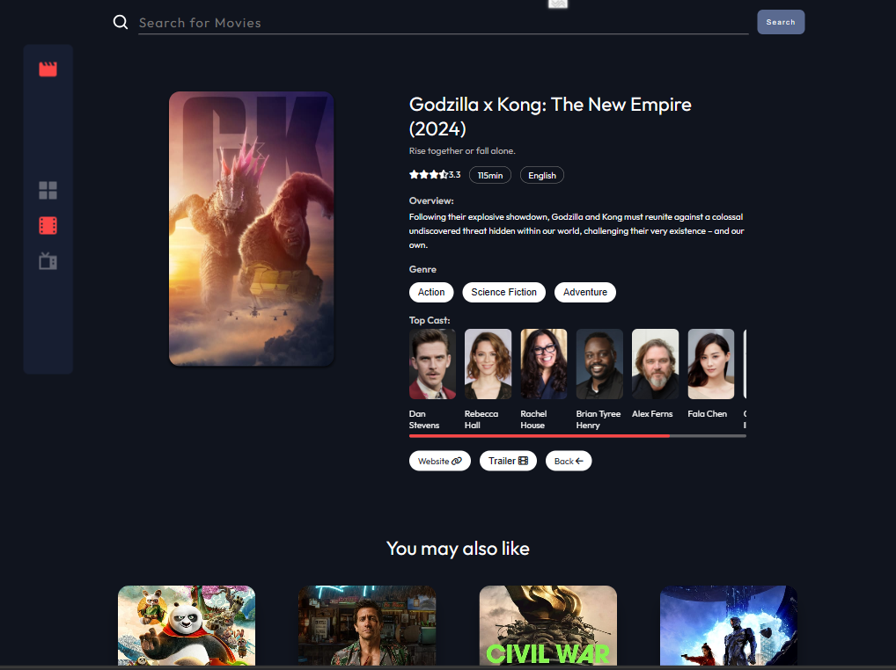
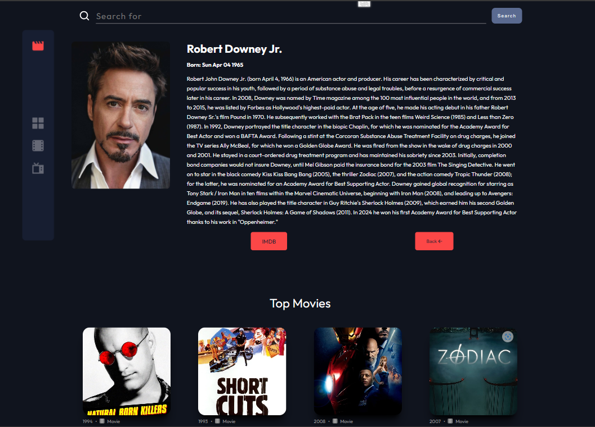

#Frontend Mentor - Entertainment web app

## Overview
- An entertainment web app built with Next.js and TailwindCSS that allows users to search for movies and tv shows.

### Links
- Solution URL: [Entertainment web app](https://github.com/sukanyagurav/Entertainment-web-app)
- Live Site URL: [Entertainment web app](https://entertainmentwebapp67.netlify.app/)

Your users should be able to:

- View the optimal layout for the app depending on their device's screen size
- See hover states for all interactive elements on the page
- Navigate between Home, Movies, TV Series 
- Search for relevant shows on all pages

# Build With 
- FlexBox / Grid
- React
- Redux toolkit
- CSS3

## Available Scripts

In the project directory, you can run:

### `npm start`

Runs the app in the development mode.\
Open [http://localhost:3000](http://localhost:3000) to view it in your browser.

The page will reload when you make changes.\
You may also see any lint errors in the console.

### `npm run build`

Builds the app for production to the `build` folder.\
It correctly bundles React in production mode and optimizes the build for the best performance.

The build is minified and the filenames include the hashes.\
Your app is ready to be deployed!

